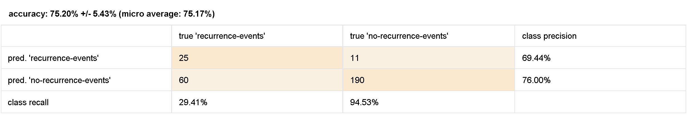

### Question 1: 

(a) **Most Discriminative Attribute:**
- Most Discriminative Attribute is the node or attribute with the highest information gain or gain ratio: Root Node

(b) **Height of the Decision Tree:**
- The height of the Decision Tree is determined by the number of levels or layers in the tree: 7

(c) **Finding a Pure Partition:**
- The leaf nodes where all instances belong to the same class (pure).

### Question 2: 
Adjusting these parameters involves a trade-off between model complexity and generalization ability.
A more complex tree (higher maximal depth, lower minimum gain) might perform well on the training data but could struggle with new, unseen data (overfitting).
A simpler tree (lower maximal depth, higher minimum gain) may generalize better but might fail to capture all the nuances in the training data (underfitting).

- **Minimal Gain:**
	The minimal gain parameter is a threshold that determines whether a split should be performed based on the information gain or gain ratio. It influences the granularity of the splits.
	A higher minimal gain will result in fewer splits because only splits with a higher information gain will be considered. This can lead to a simpler tree with fewer branches.
	
	- Higher Minimal Gain:
	    - Fewer but more significant splits in the tree.
	    - Simpler decision boundaries.
	- Lower Minimal Gain:
	    - More complex tree structure with additional branches.
	    - Higher risk of overfitting to the training data.

- **Maximal Depth:**
	The maximal depth parameter limits the maximum depth or levels of the Decision Tree. It controls the tree's complexity and depth of exploration into the feature space.
	
	- Higher Maximal Depth:
	    - Deeper tree structure with more complex decision boundaries.
	    - Captures finer details in the training data.
	- Lower Maximal Depth:
	    - Shallower tree structure with simpler decision boundaries.

- **1.** Very High Minimal Gain (0.08) & Very Low Maximal Depth (6) => Very Simple Tree

- **2.** High Minimal Gain (0.06) & Low Maximal Depth (8) => Simpler Tree

- **3.** High Minimal Gain (0.05) & Balanced Maximal Depth (10) => Simple Tree

- **4.** Balanced Minimal Gain (0.03) & Balanced Maximal Depth (10) => Balanced Tree

- **5.** Very Low Minimal Gain (0.005) & Very High Maximal Depth (20) => Very Complex Tree

### Question 3: 

- **Higher Minimal Gain:**
    - May lead to a more robust model with better generalization.
- **Lower Minimal Gain:**
    - Higher risk of overfitting to the training data.

- **Higher Maximal Depth:**
    - May lead to overfitting on training data but might increase accuracy.
- **Lower Maximal Depth:**
    - Reduced risk of overfitting but may underfit complex relationships.

- **1.** High Minimal Gain = 0.08, Low Maximal Depth = 7 => Balanced

- **2.** Low Minimal Gain = 0.01, High Maximal Depth = 15 => Potential Overfitting

- **3.** Balanced Minimal Gain = 0.02, Balanced Maximal Depth = 10

- **4.** Very High Minimal Gain = 0.1, Very Low Maximal Depth = 6 => Possibly Underfitting

- **5.** Very Low Minimal Gain = 0.001, Very High Maximal Depth = 20 => Potential Overfitting

### Question 4: 
1. **Lower K:**
    - More sensitive to noise and outliers.
    - Decision boundaries may be more influenced by individual data points.
   
2. **Higher K:**
    - **Expectation:**
        - Smoother decision boundaries.
        - Less sensitive to individual data points.
        - If k is too large, neighborhood may include points from other classes. 

- Balanced trade-off between capturing patterns and avoiding noise is needed.

- **1:** K = 1 (Low K, potentially very sensitive to noise).

- **2:** K = 3 (Low K, potentially sensitive to noise).

- **3:** K = 10 (Balanced K value).

- **4:** K = 20 (Higher K, smoother decision boundaries).

- **5:** K = 5 (Another configuration for comparison).

### Comparison with Naïve Bayes Classifier:

- **Confusion Matrix for Naïve Bayes:**

- **K-NN vs. Naïve Bayes:**
- In this case the accuracy gained in both cases are quite similar (72.45% for Naïve Bayes and 75.20% for K-NN when K=10.)
- K-NN is a non-parametric and instance-based algorithm, while Naïve Bayes is probabilistic and assumes independence between features.

### Question 5: 

1. **Does the Naïve independence assumption actually hold for the Breast dataset?**
    - The Naïve independence assumption assumes that features are independent given the class label.
    - While some off-diagonal values are not exactly zero, they are generally low, indicating relatively weak correlations between most pairs of attributes.
    - The Naïve independence assumption might still hold reasonably well.

2. **Which is the pair of most correlated attributes?**
    - node-caps & inv-nodes: pair of attributes with the highest absolute correlation coefficient:

